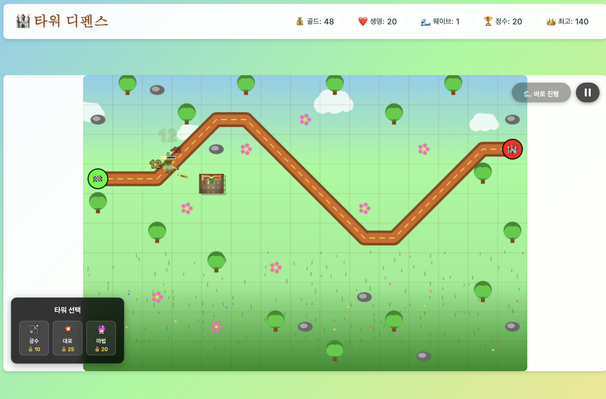

# 🏰 타워 디펜스

아름다운 중세 판타지 테마의 타워 디펜스 게임입니다. 적들의 파도를 막아내고 최고 점수를 달성해보세요!



## ✨ 게임 특징

### 🎮 핵심 게임플레이
- **3종류의 강력한 타워**: 궁수, 대포, 마법 타워
- **다양한 적들**: 빠른 정찰병, 중장갑 기사, 날아다니는 드래곤
- **20개의 도전적인 웨이브**: 점진적으로 증가하는 난이도
- **전략적 업그레이드 시스템**: 타워를 3단계까지 강화
- **화려한 시각 효과**: 파티클 시스템과 부드러운 애니메이션

### 🎨 비주얼 & UI
- **아름다운 판타지 아트 스타일**: 밝은 카툰 스타일
- **직관적인 사용자 인터페이스**: 깔끔하고 반응형 디자인
- **실시간 게임 정보**: 골드, 생명, 웨이브, 점수 표시
- **모바일 친화적**: 터치 스크린 완벽 지원

### 🛠️ 기술적 특징
- **순수 JavaScript**: 프레임워크 없이 구현
- **HTML5 Canvas**: 부드러운 60fps 렌더링
- **객체 지향 설계**: 확장 가능한 코드 구조
- **성능 최적화**: 오브젝트 풀링 및 효율적인 렌더링

## 🎯 게임 방법

### 기본 조작
1. **타워 배치**: 화면 우측의 타워를 선택하고 빈 공간에 클릭
2. **타워 관리**: 배치된 타워를 클릭하여 업그레이드 또는 판매
3. **웨이브 시작**: 준비가 완료되면 "다음 웨이브 시작" 버튼 클릭

### ⌨️ 키보드 단축키
- `1` - 궁수 타워 선택
- `2` - 대포 타워 선택  
- `3` - 마법 타워 선택
- `U` - 선택된 타워 업그레이드
- `S` - 선택된 타워 판매
- `Space` - 일시정지/재개
- `R` - 게임 재시작 (게임 오버 시)
- `H` - 도움말 표시
- `F11` - 전체화면 모드

## 🏹 타워 정보

### 궁수 타워 (💰20)
- **특징**: 빠른 공격속도, 저렴한 비용
- **장점**: 경제적이고 연사가 빠름
- **단점**: 낮은 단일 데미지
- **최적 사용**: 초반 방어, 약한 적 처리

### 대포 타워 (💰40)
- **특징**: 범위 공격, 높은 데미지
- **장점**: 여러 적을 한 번에 공격
- **단점**: 느린 공격속도, 높은 비용
- **최적 사용**: 적 무리 처리, 중반 이후

### 마법 타워 (💰60)
- **특징**: 적 둔화 효과, 유도 미사일
- **장점**: 특수 효과, 강력한 추적 능력
- **단점**: 가장 비싼 비용
- **최적 사용**: 강한 적 둔화, 후반 방어

## 👾 적 정보

### 정찰병 🏃‍♂️
- **체력**: 30 HP
- **속도**: 빠름
- **보상**: 3 골드, 5 점수
- **특징**: 빠르지만 약함, 마법에 취약

### 기사 🛡️
- **체력**: 120 HP
- **속도**: 느림
- **보상**: 8 골드, 15 점수
- **특징**: 높은 방어력, 상태 효과 저항

### 드래곤 🐉
- **체력**: 200 HP
- **속도**: 중간
- **보상**: 15 골드, 30 점수
- **특징**: 공중 유닛, 화염 브레스 공격

## 🎮 게임 시스템

### 자원 관리
- **골드**: 타워 구매 및 업그레이드에 사용
- **생명**: 적이 목적지에 도달하면 감소 (시작: 20)
- **점수**: 적 처치 및 웨이브 완료로 획득

### 웨이브 시스템
- **총 20개 웨이브**: 각각 고유한 적 구성
- **준비 시간**: 웨이브 사이 타워 배치/업그레이드 시간
- **난이도 증가**: 더 많고 강한 적들이 등장

### 업그레이드 시스템
- **3단계 업그레이드**: 각 타워를 최대 레벨 3까지 강화
- **스탯 증가**: 데미지, 사정거리, 공격속도 향상
- **비용 증가**: 레벨이 높을수록 더 비싼 업그레이드

## 🛠️ 설치 및 실행

### 로컬 실행
1. 저장소를 클론하거나 다운로드
2. `index.html` 파일을 웹 브라우저에서 열기
3. 게임 시작!

### 웹 서버 실행 (권장)
```bash
# Python 3
python -m http.server 8000

# Node.js (http-server 필요)
npx http-server

# PHP
php -S localhost:8000
```

브라우저에서 `http://localhost:8000`으로 접속

## 🔧 개발자 정보

### 프로젝트 구조
```
tower-defense/
├── index.html          # 메인 HTML 파일
├── styles.css          # 스타일시트
├── js/
│   ├── utils.js        # 유틸리티 함수들
│   ├── particles.js    # 파티클 시스템
│   ├── entities.js     # 기본 엔티티 클래스들
│   ├── towers.js       # 타워 시스템
│   ├── enemies.js      # 적 시스템
│   ├── game.js         # 메인 게임 로직
│   ├── ui.js           # UI 관리
│   └── main.js         # 진입점
└── README.md           # 이 파일
```

### 디버그 모드
URL에 `?debug=true`를 추가하면 디버그 정보가 표시됩니다.

```javascript
// 콘솔에서 사용 가능한 명령어들
gameUtils.addGold(1000);    // 골드 추가
gameUtils.setWave(10);      // 웨이브 변경
gameUtils.showStats();      // 현재 상태 표시
```

### 확장 가능성
- 새로운 타워 타입 추가
- 더 많은 적 종류
- 보스 몬스터
- 특수 능력 및 스킬
- 멀티플레이어 모드

## 🎵 향후 계획

- [ ] 사운드 효과 및 배경음악
- [ ] 더 많은 맵 및 경로
- [ ] 도전 과제 시스템
- [ ] 리더보드 기능
- [ ] PWA (Progressive Web App) 지원
- [ ] 더 많은 시각 효과

## 🐛 버그 리포트 및 기여

버그를 발견하거나 개선 사항이 있으시면 언제든지 알려주세요!

### 알려진 이슈
- 일부 모바일 브라우저에서 성능 저하 가능
- 매우 오래된 브라우저에서 호환성 문제

## 📜 라이센스

이 프로젝트는 MIT 라이센스 하에 배포됩니다.

## 🙏 감사의 말

이 게임을 플레이해 주셔서 감사합니다! 재미있게 즐기시고 최고 점수 달성에 도전해보세요! 🏆

---

**Made with ❤️ and lots of ☕**

*최고 점수를 달성하면 스크린샷을 공유해 주세요!* 📸
